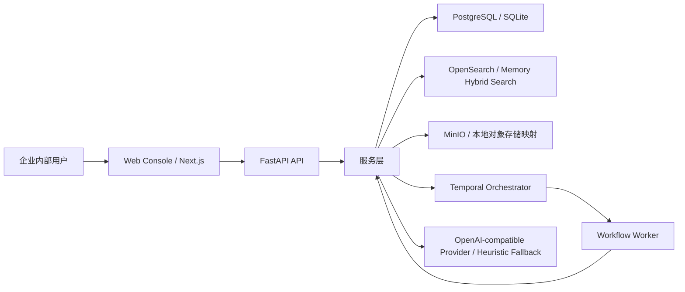

# 架构总览

## 1. 目标与范围

本项目要交付的是一个企业级 RAG 知识库平台的可演进底座。首期目标不是做自治 Agent，而是做“有引用、可追溯、可评测”的研究问答系统。

当前范围包含：

- 知识空间管理
- 单文档和批量文档导入
- 文档切块与索引
- 带引用问答
- 答案反馈
- 离线评测
- 异步任务编排
- 最小化运营控制台

当前明确不做：

- 细粒度 ACL 判权
- 外部门户
- 结构化业务数据库接入
- 报告生成型 Agent
- 定时同步与复杂连接器编排

## 2. 逻辑架构

## 3. 组件职责

### Web Console

- 负责知识空间选择、文档导入、问答发起、任务查看、反馈提交、评测执行。
- 不承载业务规则，只消费后端 API。
- 前端会轮询异步任务状态，并暴露重试/取消操作。

### FastAPI API

- 提供标准 REST 接口。
- 负责请求校验、依赖注入和错误码转换。
- 不直接保存复杂业务过程，复杂过程下沉到服务层和工作流层。

### 服务层

- `IngestionService`：导入、重建索引、文档与任务状态管理。
- `AnswerService`：检索、重排、引用组装、回答生成、trace 持久化。
- `EvaluationService`：离线评测执行、指标汇总、run 状态维护。

### 检索层

- 开发模式：内存混合检索。
- Docker/标准环境：OpenSearch 词法候选召回 + 本地 embedding rerank。
- 设计目标是对模型供应商保持解耦。

### 工作流层

- 使用 Temporal 执行导入、重建索引和评测。
- Immediate 模式仅用于轻量测试和本地无外部依赖场景。

## 4. 运行模式

### 轻量模式

- `DATABASE_URL=sqlite:///...`
- `SEARCH_BACKEND=memory`
- `WORKFLOW_BACKEND=immediate`
- 适合本地开发与 API 单测。

### 标准联调模式

- `DATABASE_URL=postgresql+psycopg://...`
- `SEARCH_BACKEND=opensearch`
- `WORKFLOW_BACKEND=temporal`
- 适合接近生产的端到端验证。

## 5. 关键设计原则

- 引用优先：回答一定要能回链到具体片段。
- 证据优先：当证据不足时宁可保守也不编造。
- 异步优先：导入和评测走 job 化模型，避免阻塞 API。
- 可演进优先：ACL、连接器、多模型路由等能力先预留数据结构。
- 环境兼容优先：同一套业务层同时支持内存模式与完整基础设施模式。

## 6. 当前已落地的企业化基础

- 预留了文档可见性、ACL 引用、连接器来源字段。
- 引入了 Temporal 和独立 worker。
- 引入了 OpenSearch 适配器，而不是只停留在内存检索 demo。
- 前端已经具备运营台雏形，而不是单纯 Swagger 演示。
