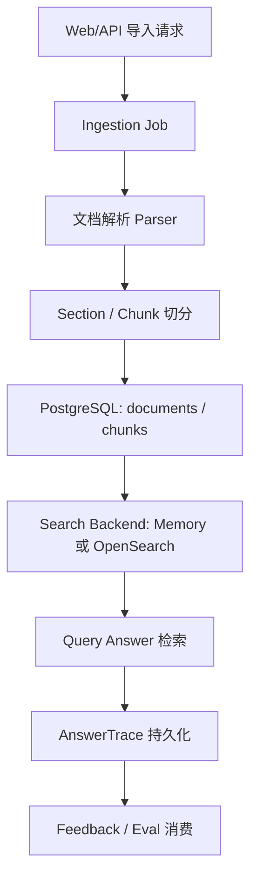
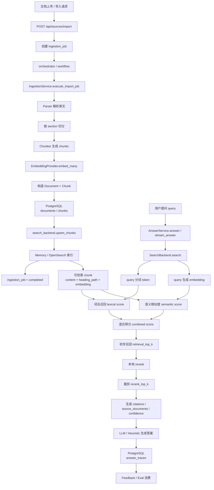

# 数据流转说明

本文档描述当前 RAG 项目里，数据从进入系统到被问答、反馈、评测消费的完整流转过程。目标是回答三类问题：

- 数据先落到哪里
- 哪些环节会做双写或异步处理
- 前端看到的状态对应后端哪一步

## 1. 总览

当前项目的数据主链路可以分成 6 段：

1. 文档进入系统
2. 文档解析与切片
3. PostgreSQL 持久化
4. 检索索引写入
5. 问答检索与答案生成
6. 反馈与评测闭环

简化流程如下：

## 1.1 入库 + 检索 + 问答总图

下面这张图把“文档入库”和“query 检索问答”两条主链路合在一起，展示从上传到最终答案落库的完整闭环：

这张总图表达的是三件事：

- 文档 chunk 会先落 PostgreSQL，再写入检索后端
- 问答时主检索来源是 Search Backend，而不是直接扫 PG
- 最终答案、反馈、评测结果又会回写 PostgreSQL，形成闭环

## 2. 文档导入流

### 2.1 入口

当前文档导入请求统一走：

- `POST /api/sources/import`

前端 `web` 当前暴露两种方式：

- `inline_content`
- 本地文件上传 `uploaded_file_base64`

后端仍兼容：

- `source_path`
- `storage_uri`

对应代码：

- [`backend/app/api/routes/sources.py`](./../backend/app/api/routes/sources.py)
- [`backend/app/schemas/documents.py`](./../backend/app/schemas/documents.py)

### 2.2 创建任务

导入请求不会直接把所有工作塞在 API 请求里完成，而是先创建一条 `ingestion_jobs` 记录。

关键字段：

- `job_kind`
- `source_uri`
- `workflow_id`
- `status`
- `request_payload`
- `attempt_count`

对应实现：

- [`backend/app/services/ingestion.py`](./../backend/app/services/ingestion.py) `create_import_job`
- [`backend/app/models/entities.py`](./../backend/app/models/entities.py) `IngestionJob`

### 2.3 工作流执行

创建任务后，系统会调用 orchestrator：

- `WORKFLOW_BACKEND=temporal` 时走 Temporal
- 轻量模式可走 immediate

状态大致为：

- `pending`
- `running`
- `completed`
- `failed`
- `cancelling`
- `cancelled`

这里有一条关键语义：

- `completed` 不表示“数据库写完就算完成”
- 它表示“数据库已写入，并且检索索引已经可查”

这保证了前端看到任务完成后，立刻发问也不会遇到“状态完成但检索不到证据”的空窗。

## 3. 解析与切片流

### 3.1 文档解析

解析器入口在：

- [`backend/app/services/parser.py`](./../backend/app/services/parser.py)

当前支持：

- `markdown`
- `html`
- `text`
- `pdf`
- `docx`
- `pptx`

处理方式：

- Markdown：按标题层级切 section
- HTML：去标签后进入 section 逻辑
- Text：归一化为单 section
- PDF / DOCX / PPTX：先走 `Docling` 转 Markdown，再复用 Markdown 解析

解析输出是 `ParsedDocument`：

- `title`
- `source_type`
- `source_uri`
- `raw_content`
- `sections`

每个 section 是 `ParsedSection`：

- `title`
- `heading_path`
- `content`
- `page_number`

### 3.2 切片

切片入口在：

- [`backend/app/services/chunking.py`](./../backend/app/services/chunking.py)

输入：

- parser 输出的 `sections`

输出：

- 一组 chunk

当前 chunk 设计目标：

- 尽量保留标题层级
- 为中文问答控制粒度
- 给引用展示和原文回链稳定边界

chunk 主要字段包括：

- `fragment_id`
- `section_title`
- `heading_path`
- `page_number`
- `start_offset`
- `end_offset`
- `token_count`
- `content`
- `embedding`

当前参数见配置文档：

- `CHUNK_SIZE` 默认 `700`
- `CHUNK_OVERLAP` 默认 `100`

## 4. 入库与索引流

### 4.1 PostgreSQL 持久化

切分完成后，数据会先写入 PostgreSQL。

核心表：

- `documents`
- `chunks`

对应模型：

- [`backend/app/models/entities.py`](./../backend/app/models/entities.py)

`documents` 保存：

- 文档标题
- 来源类型
- `source_uri`
- `storage_uri`
- `status`
- `checksum`
- `source_metadata`

`chunks` 保存：

- chunk 内容
- 标题路径
- offset
- token 数
- embedding

对应代码位置：

- [`backend/app/services/ingestion.py`](./../backend/app/services/ingestion.py) `execute_import_job`

关键顺序是：

1. 创建 `Document`
2. materialize chunks
3. `db.add_all(indexed_chunks)`
4. `db.commit()`

所以可以明确说：

- 文档切片后会落到 PG

### 4.2 检索索引写入

PG 不是唯一存储层。写完 PG 后，系统还会把 chunk 写入检索后端。

入口：

- `search_backend.upsert_chunks(...)`

检索后端有两种：

- `memory-hybrid`
- `opensearch-hybrid`

对应实现：

- [`backend/app/services/indexing.py`](./../backend/app/services/indexing.py)

这意味着当前是“双写”结构：

- PG 负责持久化主数据
- Search Backend 负责检索

### 4.3 embedding 写入时机

chunk 在落库前就会带上 embedding。

embedding provider 当前支持：

- `hash`
- `openai`

这意味着：

- `chunks.embedding` 在 PG 中有持久化副本
- 检索后端里也会写入同一份 embedding 或其检索字段表示

## 5. 问答数据流

### 5.1 查询入口

问答接口：

- `POST /api/queries/answer`
- `POST /api/queries/answer/stream`

对应代码：

- [`backend/app/api/routes/queries.py`](./../backend/app/api/routes/queries.py)

### 5.2 检索流程

问答服务入口：

- [`backend/app/services/answering.py`](./../backend/app/services/answering.py)

执行顺序：

1. 确定知识空间
2. 从 Search Backend 做召回
3. 本地 rerank
4. 组装 citations
5. 估算 confidence
6. 调用回答生成器

这里要注意：

- 问答主检索来源是 Search Backend，不是直接扫 PG
- 但在 `memory` 模式下，Search Backend 可以从 PG bootstrap

### 5.3 AnswerTrace 持久化

问答完成后，系统会把结果写入 `answer_traces` 表。

保存内容包括：

- `question`
- `answer`
- `confidence`
- `citations`
- `source_documents`
- `followup_queries`
- `evidence_snapshot`

所以问答结果不是瞬时数据，而是持久化可回放的。

## 6. 反馈流

反馈入口：

- `POST /api/feedback`

反馈会写入 `feedback` 表，核心字段包括：

- `answer_trace_id`
- `rating`
- `issue_type`
- `comments`

这使得反馈天然挂靠到具体一次问答，而不是挂在文档或知识空间的抽象层。

## 7. 评测流

### 7.1 入口

评测接口：

- `POST /api/eval/runs`

评测也走异步 run 模型，而不是同步阻塞请求。

### 7.2 数据关系

评测相关表：

- `eval_runs`
- `eval_cases`

`eval_runs` 保存：

- run 状态
- request payload
- summary
- error_message

评测执行时会复用当前问答检索能力，对返回结果做命中和指标统计。

### 7.3 输出

评测结果最终沉淀为：

- `document_recall`
- `citation_precision`
- `avg_confidence`
- 单 case 命中详情

这些结果会被前端 `evaluation` 和 `tasks` 页面消费。

## 8. 前端消费流

前端当前拆成多页面：

- `namespace`
- `dashboard`
- `documents`
- `chat`
- `tasks`
- `evaluation`
- `history`

核心读取接口：

- `/api/dashboard/summary`
- `/api/documents`
- `/api/sources/jobs`
- `/api/answer-traces`
- `/api/eval/runs`

当前前端有自动轮询：

- 只要存在 `pending / running / cancelling` 的导入任务或评测任务
- 就会继续刷新 summary、documents、jobs、traces、eval runs

因此前端看到的“任务变化”并不是本地推断，而是后端状态的周期性同步。

## 9. 失败与重试流

### 导入失败

导入失败时：

- `ingestion_jobs.status = failed`
- `error_message` 记录失败原因

用户可调用：

- `POST /api/sources/jobs/{job_id}/retry`

### 评测失败

评测失败时：

- `eval_runs.status = failed`
- `error_message` 或 `summary.error_message` 记录失败原因

用户可调用：

- `POST /api/eval/runs/{run_id}/retry`

### 取消

导入与评测都支持取消，状态通常会经历：

- `running/pending -> cancelling -> cancelled`

## 10. 一句话结论

如果只记住一句话，可以记这个：

- 文档先被解析和切片，chunk 会先持久化到 PostgreSQL，再写入检索后端；问答主要从检索后端取证据，最终结果再回写到 PostgreSQL 的 `answer_traces`、`feedback`、`eval_runs` 等表中。
