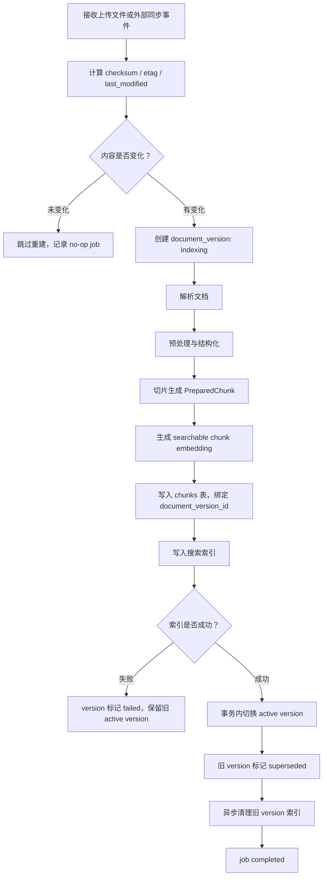

# 文档增量更新与过期失效设计

本文说明企业 RAG 平台中，文档增量更新、版本切换、索引一致性和过期失效的推荐实现方式。

## 1. 核心原则

文档更新不应被实现为简单覆盖文件。

更稳妥的方式是：

```text
Document -> DocumentVersion -> Chunk -> Search Index
```

其中：

- `Document` 表示用户可见的逻辑文档。
- `DocumentVersion` 表示每次导入、重建或外部同步产生的版本。
- `Chunk` 隶属于某个具体文档版本。
- Search Index 只应检索当前 active version 的 chunks。

核心目标：

- 不让新旧 chunk 混查。
- 不让文档处于“数据库已更新但索引不可查”的半完成状态。
- 支持版本回滚、历史审计和失败重试。
- 支持上传文件、连接器、结构化数据等不同来源的一致更新模型。

## 2. 推荐数据模型

当前项目已有：

- `documents`
- `chunks`
- `ingestion_jobs`

后续可以演进为：

```text
documents
- id
- knowledge_space_id
- title
- source_type
- source_uri
- current_version_id
- status
- checksum
- source_etag
- source_last_modified
- expires_at
- created_at
- updated_at

document_versions
- id
- document_id
- version_no
- checksum
- raw_content_uri
- status: indexing | active | superseded | archived | expired | failed
- change_reason
- created_by
- created_at
- activated_at

chunks
- id
- document_id
- document_version_id
- knowledge_space_id
- fragment_id
- chunk_type
- parent_id
- section_title
- heading_path
- page_number
- start_offset
- end_offset
- token_count
- content
- embedding
```

搜索索引记录也需要包含版本字段：

```json
{
  "chunk_id": "...",
  "document_id": "...",
  "document_version_id": "...",
  "knowledge_space_id": "...",
  "fragment_id": "...",
  "chunk_type": "fixed",
  "parent_id": null,
  "content": "...",
  "embedding": []
}
```

## 3. 增量更新流程

推荐使用 copy-on-write 流程，不要原地覆盖旧 chunks。



关键规则：

- 新版本完整写入数据库和搜索索引之前，旧 active version 继续可用。
- 只有新版本索引可查询后，才切换 `documents.current_version_id`。
- 切换 active version 和更新 version 状态应放在同一个数据库事务内。
- 旧版本索引可以立即删除，也可以异步清理，但查询层必须只允许 active version 参与检索。

## 4. 为什么不要原地覆盖

不推荐流程：

```text
删除旧 chunks -> 重新解析 -> 重新切片 -> 写新 chunks -> 写索引
```

风险：

- 解析失败会导致文档无 chunk。
- embedding 失败会导致文档不可检索。
- 搜索索引写入失败会导致前端看到完成前后状态不一致。
- 用户问答可能命中新旧混杂内容。

推荐流程：

```text
保留旧 active version
创建新 indexing version
新 version 完整写库 + 写索引
成功后原子切换 active
最后清理旧 version
```

这种方式可以保证：

- 更新失败不影响旧版本问答。
- active version 永远可检索。
- 历史回答可回溯到当时使用的文档版本。

## 5. 过期失效策略

过期失效可以分为三类。

### 5.1 立即失效

适用场景：

- 用户删除文档。
- 用户手动覆盖文档。
- 管理员撤回错误文档。
- 合规原因要求立刻停止检索。

推荐实现：

- `documents.status = deleted | disabled | updating`
- 查询层过滤不可用文档。
- 搜索索引删除对应 `document_id` 或当前 active version。
- 保留版本记录用于审计，必要时再做物理删除。

### 5.2 定期失效

适用场景：

- SharePoint、飞书、Google Drive、Confluence 等连接器同步。
- URL、对象存储、共享盘文件周期检测。

推荐实现：

- 保存 `source_etag`。
- 保存 `source_last_modified`。
- 保存 `content_length` 或 checksum。
- 定时同步时优先比较元数据，元数据变化后再拉取正文。
- 正文 checksum 变化才触发 reindex job。

### 5.3 TTL 失效

适用场景：

- 临时政策。
- 有效期公告。
- 活动规则。
- 报表快照。
- 会过期的外部数据。

推荐实现：

- `documents.expires_at`
- `document_versions.expires_at`，如需要版本级有效期
- 查询层默认过滤 expired 文档
- 后台 job 定期将过期文档标记为 `expired`
- 前端展示过期状态和最近更新时间

## 6. 搜索索引一致性

索引层建议至少支持以下字段：

- `document_id`
- `document_version_id`
- `knowledge_space_id`
- `chunk_id`
- `chunk_type`
- `parent_id`
- `content`
- `embedding`

有两种实现方式。

### 6.1 只保留 active version 索引

流程：

- 新 version 写入索引。
- active 切换成功。
- 立即删除旧 version 索引。

优点：

- 查询过滤简单。
- 索引体积更小。

缺点：

- 清理失败时需要额外补偿。
- 回滚时可能需要重新写旧版本索引。

### 6.2 新旧版本短暂共存

流程：

- 新旧 version 都可存在于索引。
- 查询时 filter active `document_version_id`。
- 后台 cleanup job 异步清理旧版本。

优点：

- 切换更安全。
- 方便回滚。
- 清理任务失败不会影响查询正确性。

缺点：

- 查询层必须知道 active version。
- 索引体积会短暂增大。

生产环境更推荐第二种。

## 7. 回滚与历史审计

版本状态建议采用：

```text
indexing -> active -> superseded -> archived -> deleted
                 \-> expired
                 \-> failed
```

回滚流程：

1. 选择一个可回滚的旧 version。
2. 确认旧 version 的 chunks 和索引仍存在。
3. 如果索引不存在，重新写入该 version 的 chunks。
4. 切换 `documents.current_version_id`。
5. 原 active version 标记为 `superseded`。

历史回答建议在 `answer_traces.evidence_snapshot` 中保留：

- `document_id`
- `document_version_id`
- `chunk_id`
- `fragment_id`
- `quote`
- `score`

这样即使文档后续更新，也可以解释历史回答当时依据的是哪个版本。

## 8. 对当前项目的落地路径

### 8.1 第一阶段：最小版本化

目标：

- 引入 `document_versions`。
- `chunks` 增加 `document_version_id`。
- `documents` 增加 `current_version_id`。
- 搜索索引增加 `document_version_id`。

导入和 reindex 调整：

- import 创建第一个 version。
- reindex 创建新 version，而不是直接删除旧 chunks。
- 新 version 写库和写索引成功后，再切换 active。

查询调整：

- 检索只返回 active version chunks。
- `get_fragment` 需要能按 active version 查，也需要支持历史 version 查。

### 8.2 第二阶段：变更检测

目标：

- 上传文件通过 checksum 判断是否需要重建。
- 连接器通过 `etag`、`last_modified`、checksum 判断是否需要同步。
- no-op 更新也记录 job，便于前端展示“无变化”。

建议新增字段：

- `documents.source_etag`
- `documents.source_last_modified`
- `documents.checksum`
- `ingestion_jobs.change_detected`
- `ingestion_jobs.change_reason`

### 8.3 第三阶段：过期和清理

目标：

- 支持 `expires_at`。
- 支持 `expired` 状态。
- 增加 cleanup job。
- 支持保留最近 N 个版本。

清理策略示例：

- active version 永远保留。
- 最近 3 个 superseded versions 保留。
- 超过 90 天的 archived versions 可物理删除。
- 搜索索引中的 superseded versions 可更早清理。

### 8.4 第四阶段：回滚和审计

目标：

- 前端展示版本历史。
- 支持管理员回滚。
- answer trace 可显示历史引用版本。
- 导入失败时可查看失败 version 的错误和诊断信息。

## 9. 与异步任务的一致性

当前项目已经有 `ingestion_jobs` 和 Temporal/immediate 工作流。

版本化后，任务状态应满足：

- `completed`：新 version 已写库、已写索引、已成为 active version。
- `failed`：新 version 未成为 active，旧 active version 继续可用。
- `cancelled`：新 version 未成为 active，临时数据可清理。

推荐 job payload 增加：

```json
{
  "document_id": "...",
  "document_version_id": "...",
  "attempt_count": 1,
  "change_reason": "source_changed"
}
```

## 10. 设计检查清单

实现前建议逐项确认：

- 是否所有 chunks 都绑定 `document_version_id`？
- 搜索索引是否包含 `document_version_id`？
- 查询是否只检索 active version？
- 新 version 索引失败时，旧 active version 是否仍可用？
- active 切换是否是数据库事务？
- old version 索引清理失败是否可重试？
- 删除文档是否同时处理数据库状态和搜索索引？
- 历史 answer trace 是否能回溯到旧 version？
- API 和 worker 是否使用一致的版本化逻辑？
- 前端是否能展示 updating、failed、expired、superseded 等状态？
