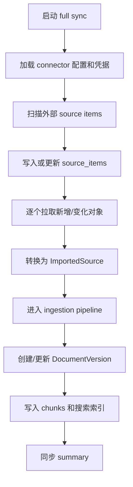
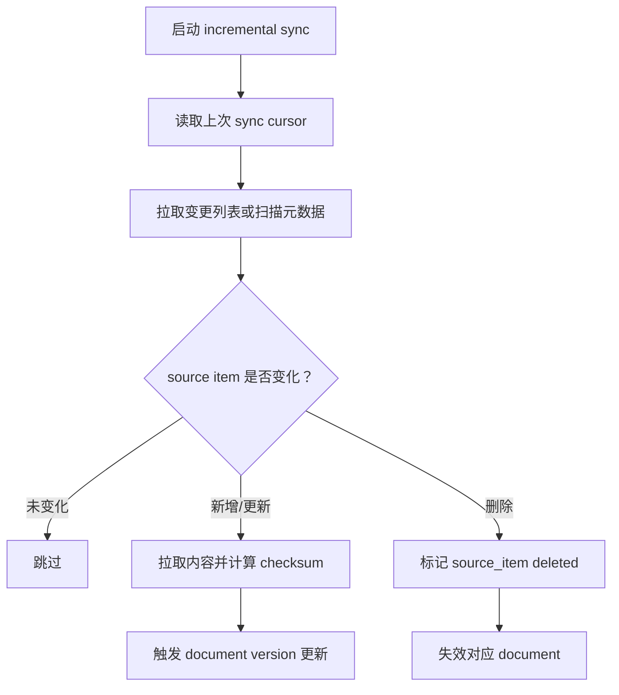

# 连接器体系设计

连接器体系用于让 RAG 平台从企业外部数据源自动拉取、同步、更新和失效内容。

当前项目主要支持：

```text
用户前端上传文件 -> 后端解析 -> 切片 -> 索引 -> 问答
```

连接器体系要扩展为：

```text
系统连接企业数据源 -> 定时同步 -> 变化检测 -> 增量更新 -> 版本切换 -> 过期失效 -> 问答检索
```

## 1. 目标

连接器体系的目标：

- 减少人工上传。
- 自动保持知识库内容更新。
- 处理外部文件新增、修改、删除、移动、重命名。
- 支持不同来源复用统一的解析、预处理、切片、索引、问答链路。
- 为后续 ACL、审计、版本化、连接器 marketplace 和企业集成打基础。

## 2. 常见连接器类型

文本和文档型数据源：

- SharePoint / OneDrive
- Google Drive
- 飞书文档 / 钉钉文档 / 企业微信文档
- Confluence
- Notion
- S3 / MinIO / OSS
- 本地共享盘
- 网站 URL / Sitemap
- 邮箱 / 工单系统

研发协作数据源：

- GitHub / GitLab
- Jira
- Linear
- Wiki
- 代码仓库文档

结构化数据源：

- PostgreSQL / MySQL
- ClickHouse / DuckDB
- Excel / CSV 文件目录
- 数据仓库表
- BI 报表导出

## 3. 核心概念

```text
Connector Definition
  连接器类型定义，例如 sharepoint、notion、s3、database。

Connector Instance
  某个企业实际配置的一条连接，例如“研发部 SharePoint”。

Credential
  访问凭据，例如 OAuth token、API key、数据库账号、服务账号。

Source Item
  外部数据源里的一个文件、页面、表、issue、邮件或记录集合。

Sync Job
  同步任务，例如全量同步、增量同步、定时同步、手动重试。

Change Detection
  变化检测，例如 etag、last_modified、checksum、版本号、删除标记。

Imported Source
  连接器拉取后交给统一 ingestion pipeline 的标准输入对象。
```

## 4. 推荐数据模型

### 4.1 connectors

表示一个连接器实例。

```text
connectors
- id
- type: sharepoint | google_drive | s3 | database | ...
- name
- knowledge_space_id
- config
- status: active | paused | error | disabled
- sync_mode: manual | scheduled | webhook
- schedule
- created_at
- updated_at
```

`config` 中只保存非敏感配置，例如：

- 站点 URL
- 文件夹路径
- include/exclude pattern
- 数据库 schema/table 白名单
- 同步频率
- 文件类型过滤

敏感信息不要放在 `config`。

### 4.2 connector_credentials

保存连接器凭据。

```text
connector_credentials
- id
- connector_id
- auth_type: oauth | api_key | basic | service_account
- encrypted_secret
- expires_at
- refresh_metadata
- created_at
- updated_at
```

注意：

- `encrypted_secret` 必须加密存储。
- 日志中不能打印 token、key、password。
- OAuth 类型连接器需要支持 refresh。

### 4.3 source_items

映射外部数据源中的具体对象。

```text
source_items
- id
- connector_id
- external_id
- source_uri
- title
- mime_type
- etag
- last_modified
- checksum
- document_id
- status: active | deleted | skipped | error
- last_synced_at
- created_at
- updated_at
```

用途：

- 记录外部对象与内部 document 的对应关系。
- 做增量同步和变化检测。
- 处理外部删除和重命名。
- 保存同步错误和跳过原因。

### 4.4 sync_jobs

记录连接器同步任务。

```text
sync_jobs
- id
- connector_id
- status: pending | running | completed | failed | cancelled
- sync_type: full | incremental | retry | webhook
- started_at
- completed_at
- summary
- error_message
- created_at
- updated_at
```

`summary` 可记录：

```json
{
  "scanned": 1200,
  "created": 20,
  "updated": 12,
  "deleted": 3,
  "skipped": 1160,
  "failed": 5
}
```

## 5. 标准 ImportedSource 合同

无论外部来源是什么，连接器最终都应该输出统一对象，交给 ingestion pipeline。

```text
ImportedSource
- title
- source_uri
- source_type
- content
- file_bytes
- file_name
- mime_type
- metadata
- checksum
- external_id
- connector_id
- source_item_id
```

规则：

- 文本型来源可以直接提供 `content`。
- 文件型来源提供 `file_bytes`、`file_name`、`mime_type`。
- 结构化来源可以提供 `content` 摘要和结构化 metadata，也可以进入单独的 structured ingestion pipeline。
- `metadata` 应保留外部来源信息，例如作者、更新时间、路径、权限摘要、表名、sheet 名等。

## 6. 同步流程

### 6.1 全量同步



适用场景：

- 首次接入连接器。
- 大规模配置变更。
- 灾难恢复或重新同步。

### 6.2 增量同步



变化检测优先级：

1. 外部 change token / cursor
2. `etag`
3. `last_modified`
4. `content_length`
5. 内容 checksum

### 6.3 Webhook 同步

部分系统支持 webhook，例如文件变更事件。

推荐策略：

- webhook 只作为快速通知。
- 收到事件后创建 sync job。
- sync job 再去外部系统确认当前状态。
- 不完全信任 webhook payload，因为事件可能乱序、重复或丢失。

## 7. 与文档版本化的关系

连接器不应直接覆盖 document。

推荐关系：

```text
connector -> source_item -> document -> document_version -> chunks
```

外部 source item 变化时：

- 如果 checksum 不变：记录 no-op。
- 如果内容变化：创建新的 `document_version`。
- 如果外部删除：将 source item 标记 deleted，并让 document 失效。
- 如果外部重命名：更新 title/source_uri，但不一定重建 chunks。

更多版本切换细节见：

- [`11-document-versioning-and-expiration.md`](./11-document-versioning-and-expiration.md)

## 8. 权限与 ACL

首期项目可以不做细粒度 ACL，但连接器模型必须预留字段。

建议保留：

- `visibility_scope`
- `source_acl_refs`
- `connector_id`
- `source_item_id`
- `external_owner`
- `external_permissions_snapshot`

后续增强方向：

- 同步外部权限摘要。
- 将用户身份映射到外部系统身份。
- 查询时按用户权限过滤 document/chunk。
- 记录权限变更并触发索引刷新。

## 9. 错误处理与重试

连接器常见失败：

- 凭据过期。
- API rate limit。
- 外部文件被删除。
- 文件格式不支持。
- 单个大文件解析超时。
- 网络失败。
- 外部权限不足。

推荐策略：

- connector 级错误不应阻塞所有历史数据检索。
- 单个 source item 失败，不应导致整个 sync job 全部失败。
- 失败 source item 记录 `status=error` 和错误摘要。
- 对临时错误使用指数退避重试。
- 对凭据错误暂停 connector，并提示管理员重新授权。

## 10. 最小落地路径

### 10.1 第一阶段：连接器框架骨架

目标：

- 增加 `connectors`、`connector_credentials`、`source_items`、`sync_jobs`。
- 定义 `Connector` 接口。
- 定义 `ImportedSource` 标准合同。
- 支持手动触发 sync job。

接口草案：

```python
class Connector:
    def list_items(self, cursor: str | None = None) -> list[SourceItemRef]:
        ...

    def fetch_item(self, external_id: str) -> ImportedSource:
        ...

    def detect_changes(self, cursor: str | None = None) -> ChangeSet:
        ...
```

### 10.2 第二阶段：对象存储连接器

优先实现 MinIO/S3 连接器，因为它和当前对象存储能力最接近。

能力：

- 扫描 bucket/prefix。
- 根据 object etag/last_modified 判断变化。
- 拉取文件 bytes。
- 复用现有文档解析、切片、索引流程。

### 10.3 第三阶段：企业文档连接器

接入 SharePoint、Google Drive、飞书等文档源。

重点：

- OAuth 凭据管理。
- 文件夹范围配置。
- 变更检测。
- 删除和重命名处理。
- 外部权限快照。

### 10.4 第四阶段：结构化数据连接器

支持数据库、Excel、CSV 等结构化来源。

重点：

- schema introspection。
- 表级/列级 metadata。
- text-to-SQL 或 DSL 查询。
- 结构化查询结果与文本证据融合。

## 11. 设计检查清单

实现连接器前建议确认：

- 是否能唯一标识外部 source item？
- 是否保存了 `external_id`、`etag`、`last_modified`、checksum？
- 外部删除如何映射到内部 document 失效？
- 外部重命名是否需要重建索引？
- 凭据如何加密、刷新和吊销？
- 同步任务是否支持取消、重试和失败摘要？
- 单个文件失败是否影响整个 sync job？
- 连接器输出是否能进入统一 ingestion pipeline？
- 是否预留 ACL 和审计字段？
- 是否能和 document versioning 机制配合？
