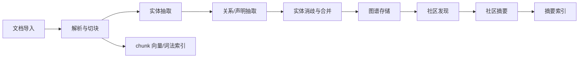
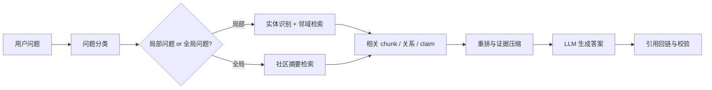
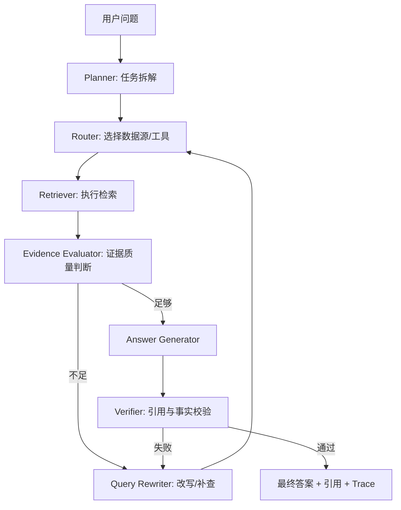
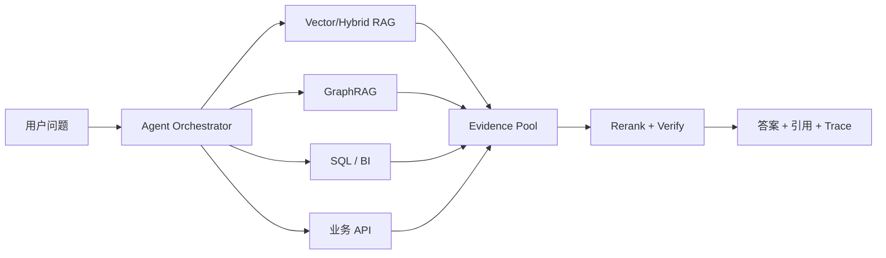

# GraphRAG and Agentic RAG

本文件解释 GraphRAG 与 Agentic RAG 的概念、架构实现方式、最佳实践，以及它们在本项目企业级 RAG 知识库平台中的落地路径。资料基于 2026-05-17 的联网查询与当前项目设计整理。

## 1. 核心区别

GraphRAG 和 Agentic RAG 都是在补普通 RAG 的短板，但方向不同：

| 类型 | 核心思想 | 主要解决的问题 | 适合场景 |
| --- | --- | --- | --- |
| GraphRAG | 把文档知识组织成实体、关系、社区摘要等图结构 | 跨文档、多跳关系、全局主题总结 | 复杂知识网络、组织关系、项目依赖、风险归因 |
| Agentic RAG | 让 Agent 动态决定查什么、怎么查、是否补查、是否调用工具 | 多步骤研究、多数据源检索、证据不足时重试 | 研究问答、企业助手、跨系统分析、工具调用任务 |

普通 RAG 更像“搜索几段资料后回答”。GraphRAG 更像“先把资料整理成知识地图，再沿着地图回答”。Agentic RAG 更像“让一个研究助手自己规划检索路线、查证、补查和生成答案”。

## 2. GraphRAG

GraphRAG = Graph + Retrieval-Augmented Generation。

Microsoft Research 对 GraphRAG 的定义是：结合文本抽取、网络分析、LLM prompt 和摘要生成的端到端系统，用于更深入理解文本数据集。它的代表论文是 `From Local to Global: A Graph RAG Approach to Query-Focused Summarization`。

传统 RAG 的基本链路是：

```text
用户问题 -> 向量/关键词检索 chunk -> 拼上下文 -> LLM 回答
```

GraphRAG 会在索引阶段多做一层知识结构化：

```text
文档 -> chunk -> 实体抽取 -> 关系抽取 -> 知识图谱 -> 社区发现 -> 社区摘要
```

查询时不只查原始 chunk，还可以查：

- 实体：公司、产品、人物、政策、系统模块。
- 关系：A 属于 B、A 依赖 B、A 影响 B、A 与 B 冲突。
- 社区：一组高度相关实体形成的主题簇。
- 原文证据：最终回答仍然回到 chunk/文档做引用。

### 2.1 适合 GraphRAG 的问题

GraphRAG 特别适合回答普通 top-k chunk 检索不擅长的问题：

- “这些文档主要讨论了哪些主题？”
- “A 项目和 B 系统之间有什么依赖？”
- “这个政策变化会影响哪些业务线？”
- “这批客户投诉背后的主要模式是什么？”
- “从所有会议纪要看，当前项目最大的风险是什么？”
- “某个系统故障和哪些上游/下游服务有关？”

这些问题往往需要跨文档综合、多跳关系推理或全局主题归纳。普通向量 RAG 容易只拿到几个局部片段，无法稳定形成全局视角。

### 2.2 GraphRAG 索引架构

典型 GraphRAG 有两条链路：索引链路和查询链路。索引链路负责把非结构化文档转成可检索的图结构。



关键步骤：

1. 文档解析  
   PDF、Word、网页、表格、扫描件先被解析成结构化文本。解析质量会直接影响图谱质量。

2. 切块  
   GraphRAG 仍然需要 chunk，因为实体、关系和最终引用都要能回到原文证据。

3. 实体抽取  
   从 chunk 中抽取项目、系统、部门、客户、法规、产品、风险等实体。

4. 关系抽取  
   抽取实体之间的关系，例如依赖、包含、影响、冲突、负责、引用、缓解。

5. 实体消歧  
   “OpenAI”“Open AI”“OpenAI Inc.” 可能指同一个实体，需要归一化到 canonical entity。

6. 图谱构建  
   保存节点、边、声明和证据来源。图结构不能脱离原文证据。

7. 社区发现  
   在图上做聚类，把相关实体聚成主题社区。

8. 社区摘要  
   对每个社区生成摘要，形成可用于全局问题回答的中间知识层。

### 2.3 GraphRAG 查询架构

查询链路通常会先判断问题类型，再选择局部图检索或全局社区检索。



常见查询方式：

| 查询类型 | 示例 | 检索策略 |
| --- | --- | --- |
| Local query | “A 系统依赖哪些服务？” | 找到 A 实体，扩展一跳/多跳邻居，回收证据 chunk |
| Global query | “这些文档的主要风险是什么？” | 检索社区摘要，聚合多个社区答案，再回到证据 chunk |
| Hybrid query | “A 项目风险和历史投诉有什么关系？” | 图邻域 + 向量检索 + 关键词过滤组合 |

GraphRAG 的关键不是用图替代向量库，而是让图谱、向量索引、词法索引协同：

```text
Graph: 组织实体、关系和全局结构
Vector: 召回语义相关片段
Keyword: 保证术语、编号、专有名词精确召回
LLM: 做综合、摘要和自然语言表达
```

### 2.4 GraphRAG 数据模型建议

在本项目早期可以先用 PostgreSQL 承载 GraphRAG-lite，不必立即引入 Neo4j 或专用图数据库。

```text
graph_entities
- id
- tenant_id
- canonical_name
- entity_type
- description
- aliases
- confidence
- created_at
- updated_at

graph_relationships
- id
- tenant_id
- source_entity_id
- target_entity_id
- relation_type
- weight
- confidence
- evidence_chunk_id
- created_at
- updated_at

graph_claims
- id
- tenant_id
- entity_id
- claim_text
- evidence_chunk_id
- confidence
- created_at

graph_communities
- id
- tenant_id
- level
- title
- summary
- entity_ids
- created_at
- updated_at
```

后续如果图查询复杂度上升，再考虑迁移到图数据库或向量图混合存储。

### 2.5 GraphRAG 最佳实践

**不要一上来全量 GraphRAG。**  
如果问题主要是 FAQ、制度查询、单文档事实问答，普通 hybrid RAG + rerank 通常更便宜、更稳定。GraphRAG 适合跨文档综合、多跳关系和全局分析。

**必须保留原文证据链。**  
实体、关系、claim、社区摘要都可能由 LLM 抽取或生成，必须绑定 `source_document_id`、`chunk_id`、文档版本和位置。最终答案不能只引用图摘要，要能回到原文 chunk。

**先做受控 schema，再做开放抽取。**  
企业场景建议先定义实体类型和关系类型，例如：

```text
EntityType: Person, Department, Product, System, Policy, Customer, Risk
RelationType: owns, depends_on, affects, mentions, conflicts_with, mitigates
```

完全开放抽取容易产生不可治理的节点和关系。

**实体消歧是成败点。**  
同名、别名、缩写、部门改名、产品代号都会让图变脏。建议引入 alias 表、canonical name、embedding 相似合并、人工审核入口和低置信度隔离机制。

**支持增量更新。**  
企业文档会持续变化。至少需要 document version、chunk version、entity mention provenance、relationship evidence count、stale edge cleanup 和 index rebuild task。

**评测要分层。**  
GraphRAG 不能只评最终答案。应分别评估实体抽取准确率、关系抽取准确率、社区摘要忠实度、检索命中率、答案引用准确率。

## 3. Agentic RAG

Agentic RAG = 把 Agent 的规划、工具调用、反思和多步执行能力嵌入 RAG 流程。

传统 RAG 是固定流水线：

```text
用户问题 -> 检索 -> 生成
```

Agentic RAG 是动态工作流：

```text
用户问题 -> 规划 -> 选择工具/数据源 -> 检索 -> 判断证据是否足够
        -> 必要时改写问题/补查/调用工具 -> 验证 -> 回答
```

它的价值不是“让回答更像 Agent”，而是让系统具备以下能力：

- 判断是否需要检索。
- 选择检索源。
- 改写查询。
- 发现证据不足。
- 补查或换策略。
- 调用 SQL、搜索、知识库、CRM、代码仓库、BI 等工具。
- 在生成前做事实校验。

### 3.1 Agentic RAG 架构

推荐用状态机或工作流实现 Agentic RAG，而不是让 LLM 自由循环。



核心模块：

| 模块 | 作用 |
| --- | --- |
| Planner | 判断任务复杂度，决定是否拆成子问题 |
| Router | 决定查向量库、OpenSearch、SQL、Graph、API 还是网页 |
| Retriever | 执行具体检索 |
| Tool Executor | 调用数据库、搜索、代码、业务系统 |
| Evidence Evaluator | 判断证据是否足够、是否冲突、是否可信 |
| Query Rewriter | 生成更适合检索的查询 |
| Memory/State | 保存中间步骤、已查证据、失败原因 |
| Verifier | 检查答案是否被证据支持 |
| Guardrails | 控制权限、成本、循环次数和安全边界 |

### 3.2 Agentic RAG 执行流程

一个受控的 Agentic RAG 流程可以这样设计：

```text
1. 分析问题类型
2. 生成检索计划
3. 执行第一轮检索
4. 判断：
   - 是否命中证据？
   - 证据是否足够？
   - 证据是否冲突？
   - 是否需要结构化查询？
5. 如不足，最多重试 N 次：
   - query rewrite
   - 换检索器
   - 扩大时间范围
   - 调用图谱/SQL/API
6. 生成答案
7. 对每个关键结论做 citation check
8. 输出答案、引用、检索 trace
```

### 3.3 工具返回 contract

Agentic RAG 的工具必须返回结构化结果，而不是只返回纯文本。检索工具建议返回：

```json
{
  "chunk_id": "chunk_123",
  "document_id": "doc_456",
  "title": "Q1 Risk Review",
  "text": "...",
  "score": 0.83,
  "source": "opensearch",
  "permissions": ["dept:risk"],
  "metadata": {
    "created_at": "2026-04-01",
    "section": "Risk"
  }
}
```

结构化 contract 能支持权限过滤、引用回链、调试 trace、评测和失败归因。

### 3.4 Agentic RAG 最佳实践

**用工作流约束 Agent。**  
不要让 Agent 无限“思考、搜索、再思考”。必须设置最大轮数、最大 token、最大工具调用次数、最大成本、超时和 fallback 策略。

**先做单 Agent，再做多 Agent。**  
推荐演进路径：

```text
固定 RAG
-> Advanced RAG
-> 单 Agent 负责检索规划和补查
-> 多 Agent 分工：检索 Agent、分析 Agent、验证 Agent
```

**权限过滤必须前置。**  
Agentic RAG 会调用多个数据源，如果权限只在最后过滤，容易泄露不可见内容。正确链路是：

```text
用户身份 -> 数据源级权限 -> 检索过滤 -> 工具调用权限 -> 输出引用校验
```

**证据不足时允许拒答。**  
企业 RAG 的价值不是总能答，而是能稳定地区分“有证据”和“没有证据”。当证据不足时，系统应该明确说明缺少哪些材料，而不是流畅推断。

**所有步骤要可观测。**  
Agentic RAG 一旦出错，必须能追踪：

- 原始问题。
- query rewrite 记录。
- 检索源和参数。
- top-k 结果。
- rerank 分数。
- 被丢弃的证据。
- 工具调用参数。
- verifier 结果。
- 最终引用。

**把反思能力做成显式检查。**  
不要只让模型在 prompt 中“请你自我检查”。更稳的方式是把检查拆成结构化步骤，例如：

```text
answer_claims = extract_claims(answer)
for claim in answer_claims:
    verify claim is supported by citations
```

## 4. GraphRAG 与 Agentic RAG 如何组合

GraphRAG 和 Agentic RAG 并不是互斥关系。更推荐的架构是：Agentic RAG 负责规划和调度，GraphRAG 作为其中一个检索工具。



对比：

| 对比项 | GraphRAG | Agentic RAG |
| --- | --- | --- |
| 核心能力 | 结构化知识和关系推理 | 动态规划、工具调用、迭代检索 |
| 主要资产 | 知识图谱、社区摘要、实体关系 | 工作流、工具、状态、策略 |
| 适合问题 | 全局总结、多跳关系、跨文档分析 | 复杂研究、多数据源、多步骤任务 |
| 主要成本 | 图构建、实体消歧、图维护 | LLM 调用、工具编排、行为控制 |
| 最大风险 | 图谱抽取错误、关系过期 | Agent 失控、循环、错误工具调用 |
| 是否替代普通 RAG | 不建议 | 不建议 |

## 5. 本项目落地建议

当前项目栈是 `FastAPI + Next.js + Temporal + PostgreSQL + OpenSearch + MinIO + Redis`。建议分阶段落地。

### 5.1 第一阶段：Advanced RAG 打底

先把普通 RAG 做扎实：

- hybrid search：OpenSearch 词法检索 + 向量检索。
- reranker：提高证据排序质量。
- query rewrite：改善召回。
- citation check：检查答案 claim 是否被引用支持。
- evaluation：建立黄金集、召回率、引用准确率、忠实度评测。

这是 GraphRAG 和 Agentic RAG 的基础。基础检索质量不稳时，引入图或 Agent 只会放大复杂度。

### 5.2 第二阶段：Agentic RAG-lite

先做一个受控的单 Agent 检索规划器：

```text
PlanSearch
-> RunHybridSearch
-> EvaluateEvidence
-> MaybeRewriteQuery
-> MaybeRunGraphSearch
-> GenerateAnswer
-> VerifyCitations
```

建议约束：

- 最多 2 次 query rewrite。
- 最多 2 种检索器。
- 每次最多 top 20 candidates。
- 最终上下文最多 N tokens。
- 证据不足必须保守回答。
- 每一步都写入 task trace 或 answer trace。

### 5.3 第三阶段：GraphRAG-lite

先使用 PostgreSQL 实现轻量图谱：

```text
DocumentImported
-> ParseDocument
-> ChunkDocument
-> ExtractEntities
-> ExtractRelationships
-> MergeEntities
-> BuildGraphCommunities
-> GenerateCommunitySummaries
-> IndexChunksAndSummaries
```

查询侧增加三种模式：

```text
普通问答：hybrid search -> rerank -> answer
关系问答：entity match -> graph neighborhood -> evidence chunks -> answer
全局总结：community summary retrieval -> evidence expansion -> answer
```

### 5.4 第四阶段：企业级治理

GraphRAG 和 Agentic RAG 进入生产前，需要补齐治理能力：

- ACL：文档、chunk、实体、关系、工具调用都要带权限过滤。
- Audit：记录谁查了什么、命中了哪些证据、生成了什么回答。
- Observability：记录检索、重排、验证、工具调用、成本和延迟。
- Evaluation：对检索、图谱抽取、Agent 步骤和最终答案分层评测。
- Cost control：限制迭代次数、工具调用次数和上下文长度。
- Versioning：文档版本、chunk 版本、图谱版本和索引版本保持一致。

## 6. 常见踩坑

| 踩坑 | 表现 | 建议 |
| --- | --- | --- |
| 过早上 GraphRAG | 架构复杂但效果不稳定 | 先用真实场景证明普通 RAG 无法解决 |
| 图谱没有证据链 | 回答看似有关系，无法回到原文 | 每条边和 claim 必须绑定 chunk |
| 实体不消歧 | 同一对象变成多个节点 | 建 canonical entity、alias、人工审核 |
| Agent 无限循环 | 延迟和成本失控 | 用状态机、最大轮数、超时和 fallback |
| 权限最后过滤 | 检索阶段已经泄露 | 权限过滤前置到每个工具和检索器 |
| 只评最终答案 | 不知道错在检索、图谱还是生成 | 建分层评测和 trace |
| 多 Agent 过早引入 | 行为不可控、调试困难 | 先单 Agent，再多 Agent |

## 7. 推荐路线

推荐顺序：

1. Advanced RAG：hybrid search、reranker、query rewrite、citation check。
2. Agentic RAG-lite：受控补查、证据评估、失败重试。
3. GraphRAG-lite：实体关系、社区摘要、跨文档综合。
4. Enterprise RAGOps：权限、审计、观测、评测、成本治理。
5. Full GraphRAG / Multi-Agent：在明确收益场景中试点，而不是替代所有问答链路。

最稳妥的原则是：先把文档解析、chunk、检索、引用、评测做扎实，再引入图和 Agent。GraphRAG 与 Agentic RAG 的价值在复杂问题中很大，但它们不是基础 RAG 质量问题的替代品。

## 8. 参考资料

- Microsoft Research, [GraphRAG](https://www.microsoft.com/en-us/research/project/graphrag/), 2024.
- Microsoft GraphRAG Documentation, [Architecture](https://microsoft.github.io/graphrag//index/architecture/), 2024.
- Darren Edge et al., [From Local to Global: A Graph RAG Approach to Query-Focused Summarization](https://arxiv.org/abs/2404.16130), 2024.
- Di Wang et al., [Agentic Retrieval-Augmented Generation: A Survey on Agentic RAG](https://arxiv.org/abs/2501.09136), 2025.
